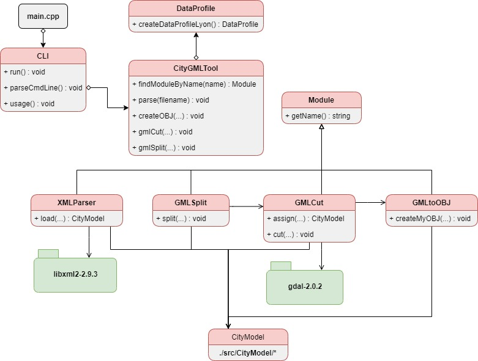
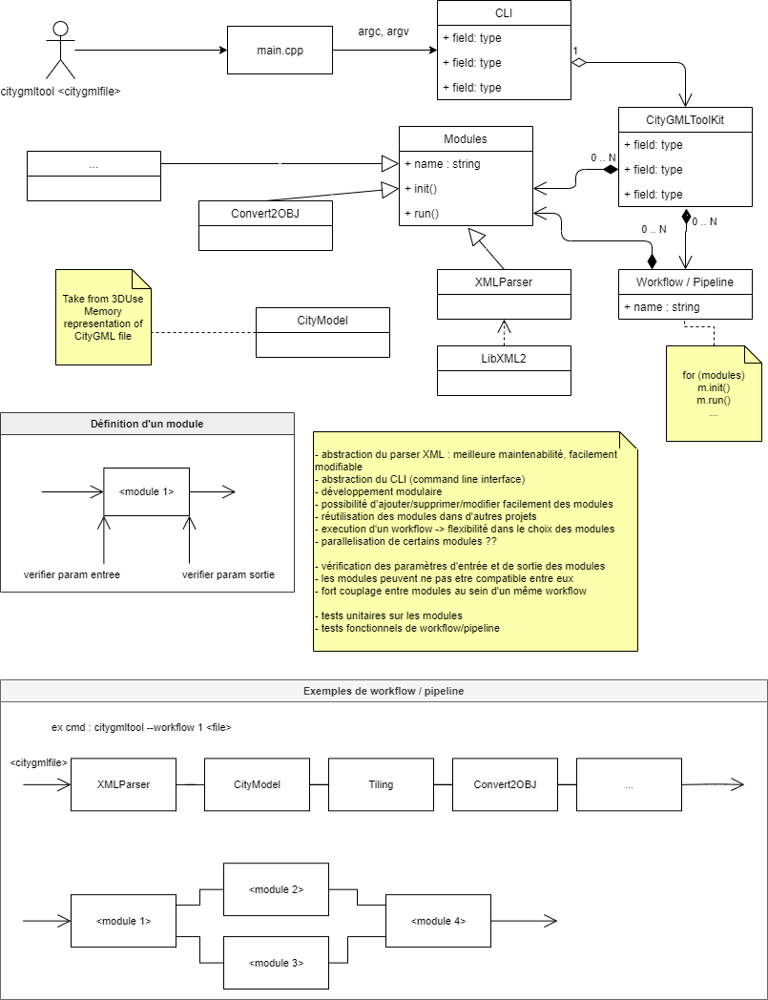

# Architecture du projet

Pour modifier le diagramme UML : https://app.diagrams.net/  
* "File" -> "Open from" -> "Device..." -> Selectionner le fichier .xml

## Dépendances

### `XMLParser` :
* `Module.hpp/.cpp`
* Bibliothèque externe : `libxml2` (dossier `/lib/libxml2-2.9.3`)
* `CityModel` (dossier `/src/CityModel`)
* Tous les fichiers dans le dossier `/src/Modules/XMLParser`

### `GMLtoOBJ` :
* `Module.hpp/.cpp`
* `CityModel` (dossier `/src/CityModel`)

### `GMLCut` :
* `Module.hpp/.cpp`
* Bibliothèque externe : `gdal` (dossier `/lib/gdal-2.0.2`)
* `CityModel` (dossier `/src/CityModel`)
* Tous les fichiers dans le dossier `/src/Modules/GMLCut`
* Module `GMLtoOBJ`(pour transformer la tuile obtenu en .obj)

### `GMLSplit` :
* `Module.hpp/.cpp`
* `CityModel` (dossier `/src/CityModel`)
* Module `GMLCut`
* Module `GMLtoOBJ`

## Archives

